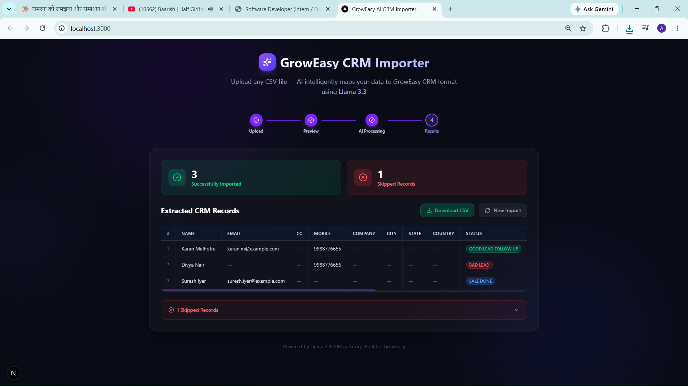
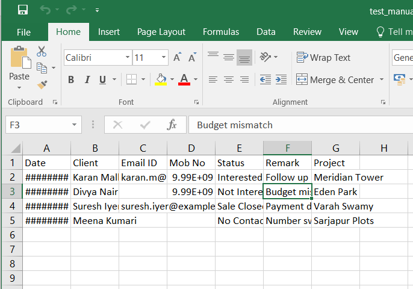

<div align="center">
  
  <h1>GrowEasy AI CRM Importer</h1>
  <p><strong>Intelligent CSV to CRM Pipeline powered by Next.js, Node.js, and Groq (Llama-3.3-70B)</strong></p>
  
  <p>
    <a href="./documentation.md"><strong>📚 Read the Architecture & Documentation</strong></a>
  </p>
</div>

---

## 👨‍💻 Submission Details
- **Position Applied For:** Software Developer (Full-Time)
- **Tech Stack:** Next.js (React 18), Node.js (Express), TypeScript, Groq SDK, Tailwind CSS, Jest

---

## ⚡ Overview
The GrowEasy AI CRM Importer is a robust, production-ready full-stack application designed to solve a common B2B SaaS problem: **ingesting unstructured CSV data**.

Instead of forcing users to manually map columns, this application uses **Llama-3.3-70B (via Groq)** to semantically understand any CSV structure and perfectly map it into the strict 15-field GrowEasy CRM format. The system is designed with defense-in-depth: the AI performs the heavy lifting, but the Express backend strictly enforces data types, fallback dates, and skip logic before passing the data to the client.

## 🚀 Features
- **Magic Mapping:** Upload any CSV with any column names, and it accurately maps to the standard fields.
- **Strict Business Rules:** Automatically skips records missing both email and phone numbers.
- **Self-Healing Dates:** Intercepts missing or invalid dates and defaults them to `today()` accurately.
- **Batch Processing:** Chunks large datasets into batches of 10 to respect AI token limits, complete with exponential backoff retries.
- **Stunning UI:** Features a dark-mode optimized drag-and-drop interface, real-time spinners, and a clean data table.

---

## 🛠️ Setup Instructions (Local Development)

### 1. Prerequisites
- **Node.js** (v18 or higher recommended)
- **Docker** (optional, but highly recommended for one-click setup)
- A **Groq API Key** (Get one for free at [console.groq.com](https://console.groq.com))

### 2. Configure Environment Variables
You need to create a `.env` file in the `backend/` directory.

1. Navigate to the backend folder: `cd backend`
2. Create a file named `.env` and add your Groq API key:
   ```env
   # backend/.env
   PORT=5000
   GROQ_API_KEY=your_groq_api_key_here
   ```
*(Note: The `.env` file is safely added to `.gitignore` to prevent API key leaks).*

### 3. Running the Application

#### Option A: Using Docker Compose (Recommended)
From the root of the project, run:
```bash
docker-compose up -d --build
```
- Frontend will run on `http://localhost:3000`
- Backend will run on `http://localhost:5000`

#### Option B: Running Locally (npm)
**Start the Backend:**
```bash
cd backend
npm install
npm run dev
```

**Start the Frontend:**
Open a new terminal and run:
```bash
cd frontend
npm install
npm run dev
```

---

## 🧪 Running Tests
The backend features a robust test suite covering CSV parsing, AI validation logic, and the batch retry processor. 

To run the unit tests:
```bash
cd backend
npm test
```
*Currently passing 43/43 tests with zero skipped.*

---

## 📸 Application Screenshots

### 1. Final Output Table (Showing Successfully Imported & Skipped Records)


### 2. Extracted Clean CSV Output Data

